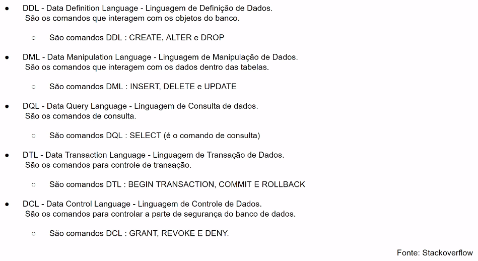

# PHP Mastery - CodeExperts

https://codeexperts.com.br/


## <a name="indice">Índice</a>

1. [Seja Bem Vindo](#parte1)     
2. [Um Pouco de Contexto](#parte2)     
3. [Configurando Ambientes](#parte3)     
4. [Iniciando com PHP](#parte4)     
5. [5. Operadores](#parte5)     
6. [6. Estruturas de Controle: Condicional](#parte6)     
7. [7. Arrays & Estruturas de Repetição](#parte7)     
8. [8. Iniciando Mini-Projeto](#parte8)     
9. [9. PHP & Formulários](#parte9)     
10. [10. Começando com Banco de Dados](#parte10)     
11. [11. PHP & Banco de Dados](#parte11)     
12. [12. Funções & Organizando CRUD](#parte12)     
13. [13. Estilizando Painel e Upload de Arquivos](#parte13)     
---


## <a name="parte1">1 - Seja Bem Vindo</a>

1 - Bem Vindo

2 - Quem Sou Eu

3 - Sobre a Plataforma

[Voltar ao Índice](#indice)

---


## <a name="parte2">2 - Um Pouco de Contexto</a>

4 - Um Pouco de História

5 - PHP: Características

6 - O Que Preciso para Programar PHP

7 - Ambientes Prontos PHP

8 - Linguagem Server Side

[Voltar ao Índice](#indice)

---


## <a name="parte3">3 - Configurando Ambientes</a>

9 - [Windows] Instalando PHP

10 - [Windows] Instalando Composer

11 - [Windows] Instalando Editor de Código

12 - [Windows] Olá Mundo

13 - [Linux] Instalando PHP & Composer

14 - [Linux] Instalando Editor de Código

15 - [Linux] Olá Mundo

16 - [MacOS] Instalando PHP

17 - [MacOS] Instalando Editor de Código

18 - [MacOS] Olá Mundo

19 - [MacOS] Instalando Composer

[Voltar ao Índice](#indice)

---


## <a name="parte4">4 - Iniciando com PHP</a>

20 - Introdução

```php
<?php
    echo "Hello world"; 
    
?>

```

21 - Comentários

```php
<?php
    # comentario de uma liha
    
    // outro modelo de comentário
    
    /*
    comentário
    de
    Varias Linhas 
    */
    
?>

```

22 - Valores Literais

```php
<?php
// Trabalhar com valores literais é trabalhar com o valor como ele é
echo "Ola Mundo";

echo 10;

echo 10.99;

```

23 - Tipos Básicos

```php
<?php

// tipo inteiro
echo 1000;

// tipo sttring: caracteres
echo "Olá mundo";

// tipo booleano
echo true;
echo false;

// tipo Poto Flutuante
echo 19.99;


```

24 - Inteiros / Ponto Flutuante

```php
<?php

//inteiros 1,2,3,4,5,6,7,8,9 -1, -2
echo -2;
echo "<br>";
echo 2;

echo "<br>";

//Sistema Octal no PHP
//Prefixado 0
echo 0777; //retorna 511 

echo "<br>";
//Sistema Hexadecimal
//Prefixado com 0x
echo 0x1FF; //retorna 511

echo "<br>";

//Float
echo 10.99;
echo "<br>";
echo 0.90;

echo "<br>";

echo "<br>";
/*apesar de retornar 1, por conta do . 
o php entende como float
*/
echo 1.0; 
//Retorna o tipo do dados informado no gettype
echo gettype(1.0);

echo "<br>";

/*
Contantes tamanho minimo e maximo 
suportado pelo PHP para tipo inteiro
*/
echo PHP_INT_MIN;
echo "<br>";
echo PHP_INT_MAX;

echo "<br>";
echo "<br>";

/*
Contantes tamanho minimo e maximo 
suportado pelo PHP para tipo float
*/
echo PHP_FLOAT_MIN;
echo "<br>";
echo PHP_FLOAT_MAX;

echo "<br>";

//Exponencial: 13.3 (E)levado a 10 +2 
//(a virgula se movimenta 2 casas para a direita por conta do +2)
echo 13.3e+2; //Res.: 1300.00
echo "<br>";

//Exponencial: 13.3 (E)levado a 10 -3 
//(a virgula se movimenta 3 casas para a esquerda por conta do -3)
echo 13.3e-3; // Res.: 0.0133
```

25 - Strings

```php
<?php

echo "Isto é uma string...";
echo "<br>";
echo gettype("Isto é uma string...");

echo '<br>';
echo 'Isto é uma string com aspas simples...';
echo '<br>';
echo gettype('Isto é uma string...');

echo '<br>';

echo "PHP"[1];
echo "<br>";
echo "ABC"[-3]; //indice negativos: PHP 7.1...
echo "<br>";
echo "Estou programando com " . "PHP";

echo "<br>";

echo 'Quero aprender \'PHP\'';


echo "<br>";

echo "Quero aprender \\ \"PHP\"";

echo "<br>";

echo "dsndsididnisd dsds
ddsidnsidnsidnsindisd 
dsdd dsodoskdoskdoksod dsokdsod
sdosdsodksokdoskdo dksodksodkso";

//NOWDOC e HEREDOC
```


26 - Funções de Manipulação de Strings

```php
<?php

//Conta os caracteres
echo strlen("Testando Strings");
echo "<br>";

//Pegar parte da string
//Pega a partir da posição 0, 7 caracteres
echo substr("Testando Strings", 0, 7);
echo "<br>";

//Pega a partir da posição -4(i), 2(in) caracteres
echo substr("Testando Strings", -4, 2);

echo "<br>";

//Pega da posição 7 até o fim da strings
echo substr("Testando Strings", 7);

echo "<br>";
//Pega da posição -7 até o fim da string
echo substr("Testando Strings", -7);

//adicionar caracteres extras

echo "<br>";
echo str_pad("Testee", 8, "-", STR_PAD_BOTH); //Teste***

//maiusculo e minusculo
echo '<br>';
echo strtoupper("fica maiuscula!");
echo '<br>';
echo strtolower("FICA MINUSCULA");

//encontrar uma ocorrencia de caracter
echo '<br>';
echo strstr("image.jpeg", ".");

echo '<br>';
echo strchr("image.png", ".");

//substituir caracteres
echo '<br>';
echo str_replace("A", "x", "batata");
echo '<br>';
echo str_ireplace("A", "x", "batata");
```

27 - Variáveis

28 - Praticando Variáveis

```php
<?php

//O operador de atribuição: =
$nome = 'Malcher';

//$nome = 'Celso';

$anos = 30;

echo $nome . ' têm ' . $anos . ' anos.';
```

29 - Diferença Aspas Simples e Duplas

```php
<?php

//O operador de atribuição: =
$nome = 'Malcher';
$anos = 30;

//usando aspas simples
echo '$nome têm $anos anos';

echo '<br>';

//usando aspas duplas
echo "{$nome}s têm $anos anos";
```


30 - NOWDOC & HEREDOC

```php
<?php
$nome = 'João';
$cargo = 'Desenvolvedor';

/*
HEREDOC: Permite uma escrita com mais
liberdade e interpreta códigos dinâmicos
no texto.
*/

echo <<<HEREDOC
Olá sou $nome, atuo como $cargo. <br>
HEREDOC;

echo <<<'NOWDOC'
Olá sou $nome, atuo como $cargo. <br>
NOWDOC;
```

31 - Case Sensitive

```php
<?php 

//O PHP diferencia escritas de variáveis
//maiusculas e minusculas em seus nomes.

$idade = 30;
$Idade = 40;
$IDADE = 50;

echo $idade;

echo '<br>';
echo $Idade;

echo '<br>';
echo $IDADE;

```

32 - Constantes

```php
<?php
//Definindo constante
define('LINK_SITE', 'http://codeexperts.com.br');

echo LINK_SITE;

echo '<br>';
echo '<br>';

//Algumas constantes do PHP
echo 'Constante PHP Versão:' . PHP_VERSION;
echo '<br>';
echo 'Meu sistema é ' . PHP_OS;

echo '<br>';
echo '<br>';
echo 'Estamos na pasta: ' . __DIR__;

echo '<br>';
echo '<br>';
echo 'Estamos na pasta: ' . __FILE__;

```

33 - Dinâmica e Fracamente Tipada

```php

<?php
//php entende o tipo como string pelo valor passado
$nome = 'José'; 
echo gettype($nome);

echo '<br>';

$nome = (string) 10;

echo gettype($nome);

//echo $nome; //um valor string na variável nome

```

34 - Conclusões Módulo

[Voltar ao Índice](#indice)

---

## <a name="parte5">5. Operadores</a>

35 - Introdução

36 - Operadores Aritméticos

```php
<?php

$num1 = 10;
$num2 = 20;

//Adição: +
echo $num1 + $num2;
echo '<br>';

//Subtração: -
echo $num1 - $num2;
echo '<br>';

//Multiplicação: *
echo $num1 * $num2;
echo '<br>';

//Divisão: /
echo $num1 / $num2;
echo '<br>';

//Módulo: % (Resto da Divisão)
echo $num1 % $num2;
echo '<br>';

echo 3**4; //3 * 3 * 3 * 3 = 81 

echo '<br>';

//Precência de operadores
echo 10 + 2 * 5; // 20

```

37 - Operadores Comparação

```php
<?php

$num1 = "30";
$num2 = 30;


//Igualdade: == ou ===
print $num1 == $num2; //Compara valor e tipo
print "<br>";
print $num1 === $num2;//Compara valor e tipo

$num1 = "20";

//Operadores de Diferença
print $num1 != $num2; //Diferença Valor
print "<br>";
print $num1 <> $num2; //Diferença Valor
print "<br>";

//Operador de não indentico: Tipo e Valor
print $num1 !== $num2;

//Operadores de Comparação Maior ou Maior Igual:
print '<br>';

$num1 = 10;
$num2 = 10;

print $num1 . ' não é maior que ' . $num2;
print '<br>';
print $num1 > $num2;
print '<br>';
print $num1 >= $num2;

//Menor ou Igual

$num1 = 30;
$num2 = 30;

print '<br>';
print $num1 < $num2; //verdeiro
print '<br>';

//10 não é igual a 30 mas continua sendo menor que 30
print $num1 <= $num2; 

```

38 - Spaceship Operator

```php

//Uso do Operador de Comparação Spaceship: <=>

$num1 = 2;
$num2 = 1;

print '<br>';
print 'Uso do Spaceship Operator';
print '<br>';

print $num1 <=> $num2; // 1

print '<br>';
print $num2 <=> $num1; // -1

print '<br>';
print $num2 <=> $num2; // 0

```

39 - Operadores de Atribuição

```php
<?php 

$num = 10;

$num += 5; //$num = $num + 5;

echo $num; // 15
echo '<br>';


$num = 10;

$num -= 5; //$num = $num - 5;

echo $num; // 5
echo '<br>';

$num = 10;

$num *= 5; //$num = $num * 5;

echo $num; // 50
echo '<br>';


$num = 10;

$num /= 5; //$num = $num / 5;

echo $num; // 2

echo '<br>';

$nome = "José";

$nome .=  " Malcher"; //$nome . " Castro";

echo $nome; // João Castro
```

40 - Operadores Lógicos

```php
<?php

// OR ou || e XOR

//O ou lógico (OR ou ||) retorna verdadeiro 
//se um ou ambos os lados retornarem verdadeiro
echo true || true || true; // 1

echo '<br>';

//Um lado ou outro podem retornar verdadeiro
//mas não ambos.
echo true XOR false;

//E lógico: AND ou &&
echo '<br>';

//Todos os testes devem ser verdadeiros
//Para que o E lógico retorne verdadeiro
echo true AND true && true; 

//Negação
echo '<br>';

// negando um verdadeiro temos false
// negando um falso, temos verdadeiro, 
// negação com negação retorna verdadeiro
echo !true; 

```

41 - Combinando Operadores Lógicos e Comparação

```php
<?php

$nome = '';
$email = '';

/*
Quero validar que todos os 
campos(aqui representados por variáveis)
sejam preenchidos...
*/
echo $nome == '' || $email == ''; // Verdadeiro 


//Se o usuário tem a idade esperada pelo sistema...

$idade = 30;
$idadeUsuario = 21;

echo "<br>";

/**
 * Se o usuário não colocar uma idade esperada,
 * que é 30, a comparação retorna false, quando
 * eu nego essse resultado, com !, eu obtenho 
 * uma comprovação do resultado da comparação.
 * 
 */
echo !($idade == $idadeUsuario);


/*
 Verificar se o usuário tem uma idade entre
 um espaço ou range interno do sistema.
 Ex.: Ter entre 21 e 30 anos.
 */
echo '<br>';

$idadeMinima = 21;
$idadeMaxima = 30;

$idadeUsuario = 31;


echo $idadeUsuario >= $idadeMinima 
     && $idadeUsuario <= $idadeMaxima;
```

42 - Operador Incremento e Decremento

```php
<?php

$num = 1;

//$num = $num + 1;
echo $num++;
echo '<br>';
echo $num;

echo '<br>';

echo ++$num; //$num + 1 : 3 
echo '<br>';
echo $num; // 3


//$num = $num - 1;
echo '<br>';

echo $num--; //3
echo '<br>';
echo $num; //2
echo '<br>';

echo --$num; // 1
echo '<br>';
echo $num; //1
```

43 - Conclusões

[Voltar ao Índice](#indice)

---

## <a name="parte6">6. Estruturas de Controle: Condicional</a>

44 - Introdução

45 - Algoritmos?

46 - Iniciando com Estrutrura Condicional

47 - Primeiras Estruturas Condicionais

```php
<?php
//Sintaxe básica de condicionais...

if(false) {
    echo "A condição foi satisfeita...";
} else {
    echo "A condição não foi satisfeita...";
}

//Sintaxe alternativa...

if (false):
    echo "A condição foi satisfeita...";
else:
    echo "A condição não foi satisfeita...";
endif;
```

48 - Senão Se

```php
<?php

$countString = strlen('Carlos'); //6

if($countString == 5) {
    
    echo "String possui 5 caracteres...";

} else if($countString == 6) {
    
    echo "String possui 6 caracteres...";

} else {

    echo "A string não possui cinco caracteres...";

}


if ($countString == 5):
    echo "String possui 5 caracteres...";
elseif ($countString == 6):
    echo "String possui 6 caracteres...";
else:
    echo "A string não possui cinco caracteres...";
endif;
```

49 - Switch

```php
<?php

$fruta = "manga";

switch($fruta) {
    //Colocar os testes a serem executados...
    case "maçã":
        echo "A fruta recebida é maçã!";
    break;

    case "laranja":
        echo "A fruta recebida é laranja!";
    break;

    case "uva":
        echo "A fruta recebida é uva!";
    break;

    default:
        echo "A fruta não é servida aqui...";
}
```

50 - Operador Ternário

```php
<?php

$num = 20;

echo $num == 10 ? "Sim, é igual a 10" 
                : "Não é igual a 10";
echo '<br>';

$valorRecebido = $num == 20 ? "O valor recebido é 20"
                            : "O valor não é 20";

echo $valorRecebido;

echo '<br>';

$quantidade = 0;

$quantidadeRecebida = $quantidade ?: -1;

echo $quantidadeRecebida;
```

51 - Mais da Escrita do If

```php
<?php

$idadeMinima = 21;
$idadeMaxima = 30;

$idadeUsuario = 31;


if($idadeUsuario >= $idadeMinima && $idadeUsuario <= $idadeMaxima)  
    echo "Você possui a idade esperada!"; 

```

52 - Conclusões

[Voltar ao Índice](#indice)

---

## <a name="parte7">7. Arrays & Estruturas de Repetição</a>

53 - Introdução

54 - Arrays?

55 - Praticando Arrays

```php
<?php

//Escrita padrão de arrays
$listaFrutas = array('laranja', 'maçã', 'uva');

//Escrita Reduzida: short-syntax ou sintaxe reduzida
//Está disponivel desde php 5.4+
//$listaFrutas = ['laranja', 'maçã', 'uva'];

//Acessando Indicies do array
echo $listaFrutas[0];
echo '<br>';


echo $listaFrutas[1];
echo '<br>';

echo $listaFrutas[2];
echo '<br>';

//Visualizando estrutura do array
print_r($listaFrutas);
echo '<hr>';

//Visualizando estrutura do array com mais informações
var_dump($listaFrutas);

```

56 - Arrays Associativos

```php
<?php

$usuario = [
    'nome' => 'Nanderson Castro',
    'email' =>  'nandokstro@gmail.com',
    'idade' => 30,
    'altura' => 1.70,
    'brasileiro' => true
];


echo $usuario['nome'] . ' com o e-mail ' . $usuario['email']
. ' têm a idade de ' . $usuario['idade'];
```

57 - Array Multi-Dimensional

```php
<?php

$usuarios = [

    [
        'nome' => 'Usuário 1',
        'email' => 'emailUm@email.com',
        'endereco' => [
            'cep' => '65000-000'
        ]
    ],

    [
        'nome' => 'Usuário 2',
        'email' => 'emailDois@email.com',
        'endereco' => [
            'cep' => '68000-000'
        ]
    ]
];

/**
 * [
 *    0 => array: array-associativo(
 *                     'nome: string', 
 *                     'email: string', 
 *                     'endereco': array-associativo(cep)),
 * 
 *    1 => array: array-associativo(
 *                     'nome: string', 
 *                     'email: string', 
 *                     'endereco': array-associativo(cep))
 * ]
 */

// echo '<pre>';
//var_dump($usuarios);

echo '<br>';

echo $usuarios[0]['nome'] .  ', Email : ' . $usuarios[0]['email'];
echo '<br>';
echo 'Endereço CEP: ' . $usuarios[0]['endereco']['cep'];
echo '<hr>';

echo '<br>';

echo $usuarios[1]['nome'] .  ', Email : ' . $usuarios[1]['email'];
echo '<br>';
echo 'Endereço CEP: ' . $usuarios[1]['endereco']['cep'];
```

58 - Funções para Arrays

```php
<?php

$listaFrutas = ['maçã', 'goiaba', 'uva'];

//Contar o tamanho do array...
echo count($listaFrutas);
echo '<br>';
echo sizeof($listaFrutas); // Alias ou apelido para count...

//Verificar se o array tem um elemento... 

//O in_array vai retornar true se o item 
//buscado existe no array do segundo parâmetro
echo '<br>';
$frutaEstaNoArray = in_array('goiaba', $listaFrutas);

echo $frutaEstaNoArray ? 'Sim está na cesta de frutas'
                       : 'Não está na cesta de frutas!';

//Posso adicionar items a um array existente...
print'<hr>';

$carrinho = [
    'Item: Mouse'
];

print_r($carrinho);

array_push($carrinho, 'Item: Teclado');

print '<hr>';
print_r($carrinho);

//Somar itens de um array

$precos = [19.99, 20.99, 2.99, 10, 0.50];
print '<hr>';
echo 'Resultado da soma é: ' . array_sum($precos);

```

59 - Operadores para Arrays

```php
<?php 

//Array da esquerda é adicionado ao da direita
// na soma, tal qual uma junção e se existirem
//chaves identificas, as chaves do array a direita serão
//ignoradas...
$listaFrutasUm = ['maçã'];

$listaFrutasDois = ['laranja', 'banana', 'uva'];

//Somar dois arrays com o operador: +
$listaFrutas = $listaFrutasUm + $listaFrutasDois;

print_r($listaFrutas);

//Comparando arrays

$listaFrutasUm = ['laranja', 'banana', 'uva'];

$listaFrutasDois = [2 => 'uva', 1 => 'banana', 0 => 'laranja'];

//== Compara os indicies e os valores 
var_dump($listaFrutasUm == $listaFrutasDois); //true

/*
=== Compara os indicies, valores e se os indicies 
estão na mesma ordem
*/
var_dump($listaFrutasUm === $listaFrutasDois); //false
```

60 - Estruturas de Repetição

61 - For

```php
<?php

$listaFrutas = ['uva', 'banana', 'laranja', 'maçã', 'goiaba'];

//Escrita padrão...
for($i = 0; $i < count($listaFrutas); $i++) {
    echo $listaFrutas[$i] . '<br>';
}

echo '<br>';

//Escrita alternativa...
for ($i = 0; $i < count($listaFrutas); $i++):
    
    echo $listaFrutas[$i] . '<br>';

endfor;
```

62 - While

```php
<?php
$listaFrutas = ['uva', 'banana', 'laranja', 'maçã', 'goiaba'];

$i = 0;

//Escrita padrão...
while($i < count($listaFrutas)) {
    echo $listaFrutas[$i] . '<br>';
    $i++;
}

echo '<hr>';

$i = 0;
//Escrita alternativa...
while ($i < count($listaFrutas)):
    
    echo $listaFrutas[$i] . '<br>';
    $i++;

endwhile;
```

63 - Do While

```php
<?php
$listaFrutas = ['uva', 'banana', 'laranja', 'maçã', 'goiaba'];

$i = 0;

do{

    echo $listaFrutas[$i] . '<br>';
    $i++;

} while($i < count($listaFrutas));
```

64 - Foreach

```php
<?php

//$numeros = range(0, 10);

//echo '<pre>';
//var_dump($numeros);

//foreach($numeros as $numero) {
//  echo $numero . '<br>';
//}
$listaFrutas = ['uva', 'banana', 'laranja', 'maçã', 'goiaba'];

foreach($listaFrutas as $i => $fruta) {
    print $i . ' - ' . $fruta . '<br>';
}

```

65 - Iterando em Arrays MultiDimensionais

```php

<?php

$usuarios = [

    [
        'nome' => 'Usuário 1',
        'email' => 'emailUm@email.com',
        'endereco' => [
            'cep' => '65000-000'
        ]
    ],

    [
        'nome' => 'Usuário 2',
        'email' => 'emailDois@email.com',
        'endereco' => [
            'cep' => '68000-000'
        ]
    ]
];

//Lê estes usuários com for.
$mensagem = '';

for($i = 0; $i < count($usuarios); $i++) {
    $mensagem .= $usuarios[$i]['nome'];
    $mensagem .= ', têm o e-mail ' . $usuarios[$i]['email'];
    $mensagem .= '. Possui o CEP.: ' . $usuarios[$i]['endereco']['cep'];
    $mensagem .= '<hr>'; //0, 1
}

echo $mensagem;

echo '<br>';

$mensagem = '';

foreach($usuarios as $usuario) {

    $mensagem .= $usuario['nome'];
    $mensagem .= ', têm o e-mail ' . $usuario['email'];
    $mensagem .= '. Possui o CEP.: ' . $usuario['endereco']['cep'];
    $mensagem .= '<hr>'; //0, 1

}

echo $mensagem;

```

66 - Conclusões

[Voltar ao Índice](#indice)

---


## <a name="parte8">8. Iniciando Mini-Projeto</a>

67 - Introdução

68 - Entendendo o Módulo

69 - O que são Paradigmas

70 - Iniciando Estrutura

- [08-Iniciando-Mini-Projeto](08-Iniciando-Mini-Projeto)

71 - Iniciando Navegação

72 - Recebendo Valores da URL

73 - Verificando Parâmetros da URL

74 - Inclusão de Arquivos Externos

75 - Usando Arquivo de Configuração

76 - Criando Fonte de Produtos

77 - PHP & HTML Juntos

78 - Linkando Detalhes Produto

79 - Criando Detalhe do Produto

80 - Config Link Site & Extensão PHTML

81 - Organizando Código HTML Repetido

82 - Melhorando Busca do Produto

83 - Conclusões


[Voltar ao Índice](#indice)

---
## <a name="parte9">9. PHP & Formulários</a>

84 - Introdução

85 - Iniciando Formulário

86 - Incrementando Formulário

87 - Submentendo Formulário

88 - Input Number e Select

89 - Entendendo Dados Enviados Via POST

90 - Enviando Arquivos

91 - Enviando Múltiplos Arquivos

92 - Mais Sobre Inputs

93 - Conclusões

[Voltar ao Índice](#indice)

---
## <a name="parte10">10. Começando com Banco de Dados</a>

94 - Introdução

95 - BDs e SGBDs

96 - O MySQL

97 - Banco Relacional

98 - Grupos de Comandos SQL



99 - MyISAM e InnoDB

100 - Ambiente MySQL no Windows

101 - Mysql no Linux

102 - PHPMyAdmin Linux

103 - Mysql no OS X

104 - PHPMyAdmin OS X

105 - Criando Primeiro Banco

106 - Conclusões

[Voltar ao Índice](#indice)

---

## <a name="parte11">11. PHP & Banco de Dados</a>

107 - Introdução

108 - Criando Primeira Tabela

```sql

USE controle_estoque;
CREATE TABLE produtos (
	id INT(11) PRIMARY KEY AUTO_INCREMENT,
	nome VARCHAR(255) NOT NULL,
	descricao VARCHAR(255) NULL,
	sobre LONGTEXT,
	preco FLOAT(10,2),
	criacao_em DATETIME,
	atualizacao_em DATETIME
)ENGINE=innoDBprodutos

```

109 - SQL Inserindo e Atualizando Dados

```sql
INSERT INTO `controle_estoque`.`produtos` (`nome`, `descricao`, `sobre`, `preco`, `status`, `criacao_em`, `atualizacao_em`) 
VALUES ('produto teste 1', 'descricao do produto 1', 'sobre o produto 1', '29.9', '1', '2022-01-30 18:23:21', '2022-01-30 18:23:22');
```

```sql
UPDATE `controle_estoque`.`produtos` 
    SET `descricao`='descricao do produto 1 com update', `status`='0' 
WHERE  `id`=1;
```


110 - SQL Removendo Dados

```sql
DELETE FROM `controle_estoque`.`produtos` WHERE  `id`=3;
```

111 - SQL Busca de Dados

```sql
SELECT * FROM `controle_estoque`.produtos WHERE id = 5;
```

- https://gist.github.com/NandoKstroNet/9ea095f90414384872e857afbf671fd1

```sql
-- SQL para criação de tabela produtos

CREATE TABLE produtos (
    id INT(11) PRIMARY KEY AUTO_INCREMENT,
    nome VARCHAR(255) NOT NULL,
    descricao VARCHAR(255) NULL,
    sobre LONGTEXT,
    preco FLOAT(10, 2),
    status TINYINT(1),
    criado_em DATETIME,
    atualizado_em DATETIME
)engine=innoDB;

-- SQL para inserção em tabela produtos
INSERT INTO produtos (nome, descricao, sobre, preco, status, criado_em, atualizado_em) VALUES ('Produto Teste ', 'Descrição Teste', 'Sobre o produto teste...', 29.9, 1, NOW(), NOW());

-- SQL para atualização em tabela produtos
UPDATE produtos SET nome = 'Produto Atualizado', status = 0 WHERE id = 1;

-- SQL para busca em tabela produtos
SELECT * FROM produtos;

SELECT nome, preco FROM produtos;

SELECT * FROM produtos WHERE id = 1;

SELECT * FROM produtos WHERE preco > 10;

SELECT * FROM produtos WHERE status = 1;

SELECT * FROM produtos WHERE DATE(criado_em) BETWEEN '2022-01-01' AND DATE(NOW());

-- SQL para remoção em tabela produtos

DELETE FROM produtos WHERE id = 1;
```

112 - Conectando PHP e MySQL

113 - PDO Inserção

```php
<?php

// PDO - PHP Data Object

$conexao = new PDO("mysql:dbname=controle_estoque;host=localhost", "root", "");

$conexao->setAttribute(PDO::ATTR_ERRMODE, PDO::ERRMODE_EXCEPTION);

// Inserção
$sql = "INSERT INTO produtos
        (nome, descricao, sobre, preco, status, criacao_em, atualizacao_em)
        VALUES
               ('Produto PHP', 'descrição PHP', 'sobre php', 255.99, 1, NOW(), NOW())
        ";

var_dump($conexao->query($sql));
// object(PDOStatement)#2 (1)
// { ["queryString"]=> string(212) "INSERT INTO produtos (nome, descricao, sobre, preco, status, criacao_em, atualizacao_em)
// VALUES ('Produto PHP', 'descrição PHP', 'sobre php', 255.99, 1, NOW(), NOW()) " }


```


114 - PDO Atualização

```php
$sql = "UPDATE produtos 
            SET nome = 'PHP ATUALIZADO!'
        WHERE id = 1";

var_dump($conexao->query($sql));
// object(PDOStatement)#2 (1) { ["queryString"]=> string(80) "UPDATE produtos SET nome = 'PHP ATUALIZADO!' WHERE id = 1" }
```

115 - PDO Prepared Statements

```php

$sql = "INSERT INTO produtos
        (nome, descricao, sobre, preco, status, criacao_em, atualizacao_em)
        VALUES
               (:nome, :descricao, :sobre, :preco, :status, NOW(), NOW())
        ";

$post = [
    'nome' => 'Produto Statement',
    'descricao' => 'Descrição teste',
    'sobre' => 'Testando statement',
    'preco' => 22.99,
    'status' => 1
];

$insert = $conexao->prepare($sql);

$insert->bindValue(':nome', $post['nome'], PDO::PARAM_STR);
$insert->bindValue(':descricao', $post['descricao'], PDO::PARAM_STR);
$insert->bindValue(':sobre', $post['sobre'], PDO::PARAM_STR);
$insert->bindValue(':preco', $post['preco'], PDO::PARAM_STR);
$insert->bindValue(':status', $post['status'], PDO::PARAM_INT);

var_dump($insert->execute());

```

116 - PDO Removendo Dados

```php
$id = 3;
$sql = "DELETE FROM produtos WHERE id = :id";
$delete = $conexao->prepare($sql);

$delete->bindValue(':id', $id, PDO::PARAM_INT);

var_dump($delete->execute());

```

117 - PDO Buscando Dados

```php

$id = $_GET['id'];

$sql = "SELECT * FROM produtos WHERE id = :id";
$select = $conexao->prepare($sql);

$select->bindValue(':id', $id, PDO::PARAM_INT);

$select->execute();

echo '<pre>';
var_dump($select->fetchAll(PDO::FETCH_ASSOC)); // varios itens
var_dump($select->fetchA(PDO::FETCH_ASSOC));// apenas 1 item


```

118 - Form e Banco de Dados

```php

if ($pagina == '/produto/salvar') {
    // print '<pre>';
    // var_dump($_POST); // array(4) { ["nome"]=> string(0) "" ["descricao"]=> string(0) "" ["sobre"]=> string(8) " " ["valor"]=> string(0) "" }
    // var_dump($_FILES);

    $dadosForm = $_POST;

    $dadosForm['valor'] = str_replace(['.', ','], ['', '.'], $dadosForm['valor']);


    $sql = "INSERT INTO produtos
        (nome, descricao, sobre, preco, status, criacao_em, atualizacao_em)
        VALUES
               (:nome, :descricao, :sobre, :preco, :status, NOW(), NOW())
        ";

//    $post = [
//        'nome' => 'Produto Statement',
//        'descricao' => 'Descrição teste',
//        'sobre' => 'Testando statement',
//        'preco' => 22.99,
//        'status' => 1
//    ];

    $insert = $conexao->prepare($sql);

    $insert->bindValue(':nome', $dadosForm['nome'], PDO::PARAM_STR);
    $insert->bindValue(':descricao', $dadosForm['descricao'], PDO::PARAM_STR);
    $insert->bindValue(':sobre', $dadosForm['sobre'], PDO::PARAM_STR);
    $insert->bindValue(':preco', $dadosForm['valor'], PDO::PARAM_STR);
    $insert->bindValue(':status', $dadosForm['status'], PDO::PARAM_INT);

    $insert->execute();

    // var_dump($insert->execute());
    echo $conexao->lastInsertId();

}

```

119 - Conclusões

[Voltar ao Índice](#indice)

---


## <a name="parte12">12. Funções & Organizando CRUD</a>

- 120 - Introdução

- 121 - Funções

- 122 - Parâmetros Funções

- 123 - Variadic Functions

- 124 - Escopo de Funções

- 125 - Funções Anônimas e Arrow Functions

- 126 - Iniciando Funções CRUD

- 127 - Função Criar Dados

- 128 - Função Atualizar Dados

- 129 - Função Remover e Testando Criar

- 130 - Organizando Rotas para Telas

- 131 - Listagem de Produtos

- 132 - Tela de Edição

- 133 - Processando Atualização

- 134 - Removendo Dados

- 135 - Conclusão


[Voltar ao Índice](#indice)

---

## <a name="parte13">13. Estilizando Painel e Upload de Arquivos</a>

- 136 - Introdução

- 137 - O Bootstrap 5

- 138 - Estilizando Listagem

- 139 - Estilizando Forms

- 140 - Iniciando Upload

- 141 - Imagens com Nome Único

- 142 - Coluna Foto Produto

- 143 - Salvando Foto Produto

- 144 - Organizando Lógica Upload

- 145 - Função Upload no Criar

- 146 - Exibindo Imagem Produto

- 147 - Conclusões


[Voltar ao Índice](#indice)

---